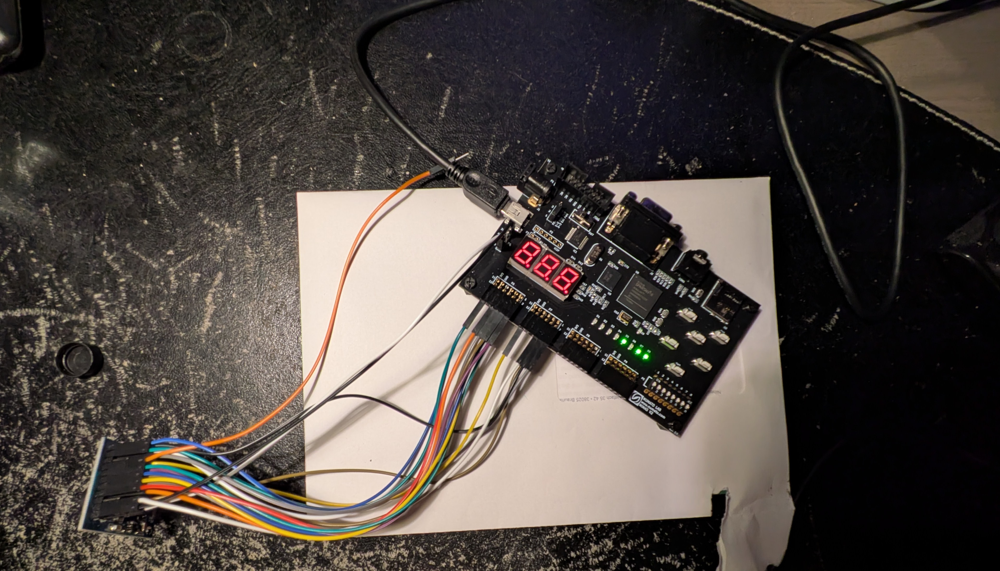
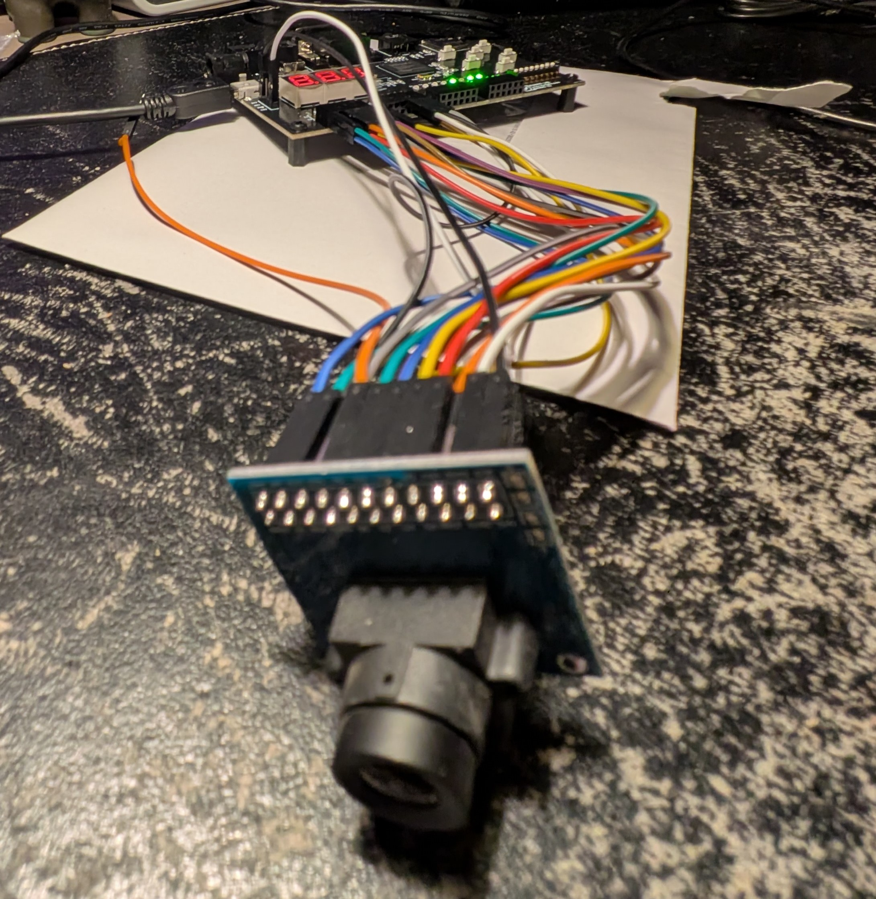
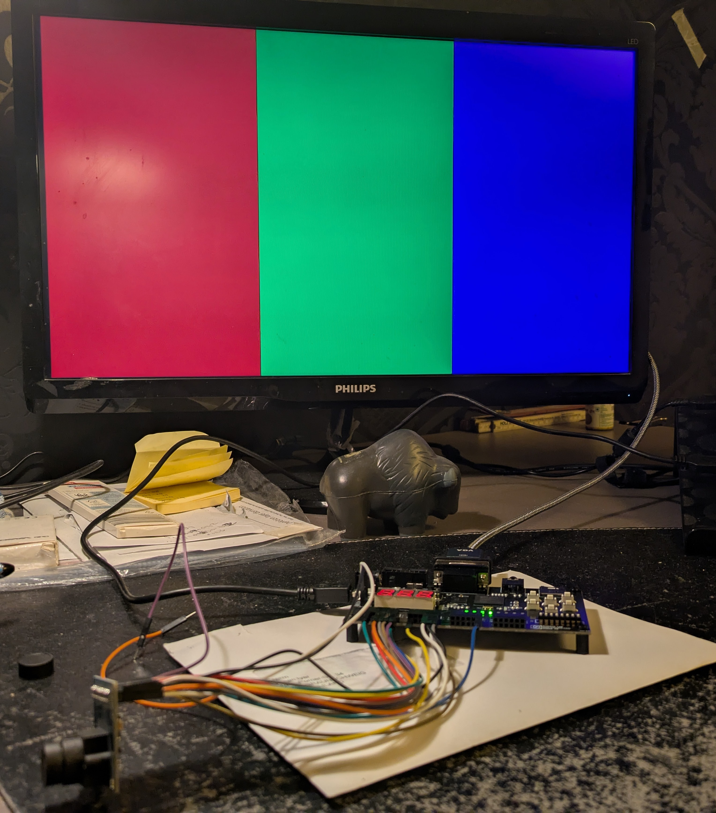
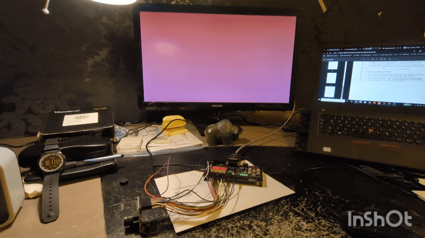
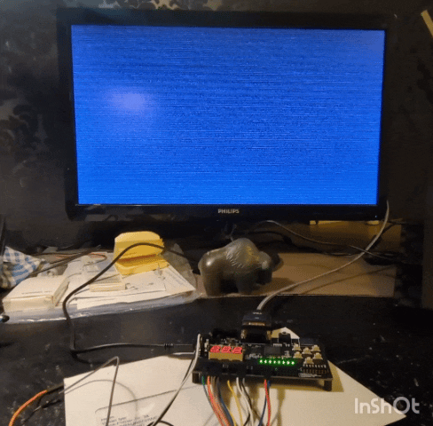
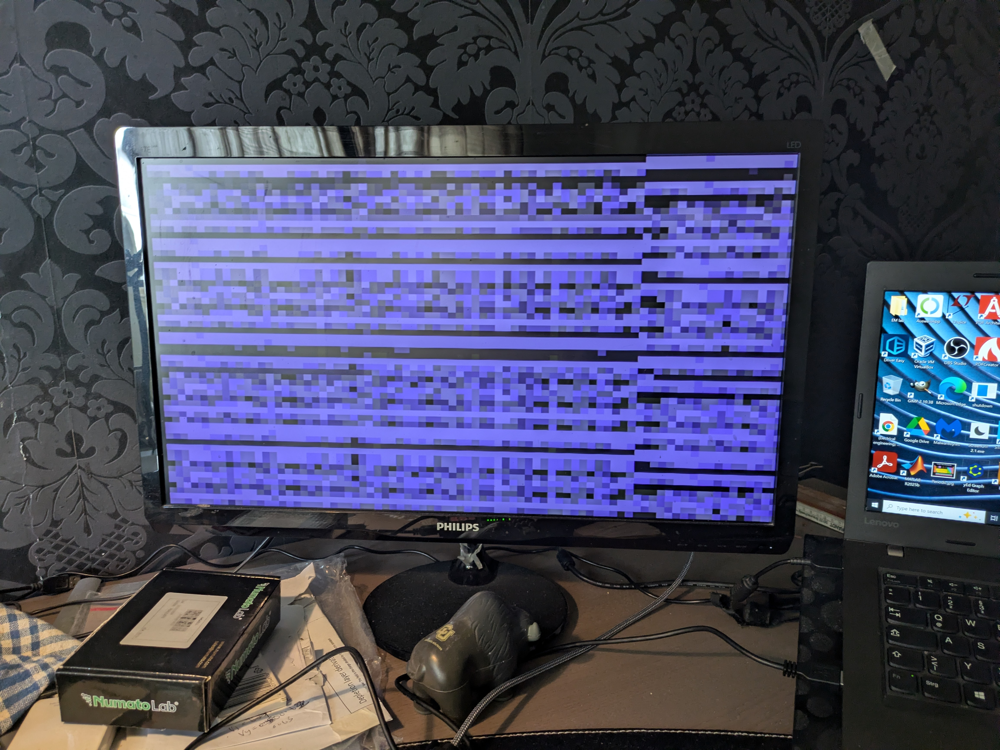
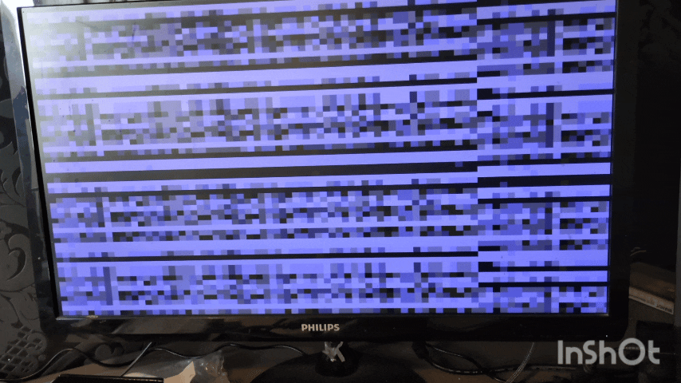

# OV7670 FIFO Camera Bring-up (Spartan-6 Mimas V2)

## Overview

This project implements a full hardware pipeline to interface an **OV7670 camera with AL422B FIFO** to a **Spartan-6 FPGA (Numato Mimas V2)** and display the output via **VGA**.

The goal is to build a real-time image acquisition and display system entirely in **VHDL**, covering:

- Camera configuration (SCCB)
- FIFO-based buffering
- VGA signal generation
- End-to-end data flow from sensor → display

---

## Current Status

✔ FPGA programming via `.bin` (Numato config tool)  
✔ SCCB communication established (camera registers configured)  
✔ FIFO read path functional  
✔ VGA output working (640×480 @ 60Hz)  
✔ End-to-end pipeline achieved:  
**Camera → FIFO → FPGA → VGA**  
✔ Grayscale pixel decoding implemented  
✔ Structured framebuffer-based output achieved  

---

## Hardware Setup

- **Camera:** OV7670 with AL422B FIFO  
- **FPGA Board:** Numato Mimas V2 (Spartan-6)  
- **Interface:**
  - Parallel data: `D0–D7`
  - FIFO control: `RCLK`, `RRST`, `OE`, `WR`, `WRST`
  - SCCB: `SIOC`, `SIOD`
  - Sync signals: `VSY`, `HREF`

---

## VGA Output Test (640×480 @ 60Hz)

A stable VGA signal was first verified using a test pattern:

- Resolution: **640×480 @ 60Hz**
- Output: RGB color bars

This confirmed:
- Correct timing generation
- Proper monitor synchronization

---

## Camera Bring-up Progress

### 1. FIFO + LED Validation

- FIFO read path verified using LEDs  
- Stable (but static) data observed on LED outputs  

---

### 2. First Camera-to-VGA Output

Initial live pipeline achieved:

- Camera data successfully reaches VGA  
- Output appears unstable due to lack of synchronization  

---

### Fullscreen Camera Output (FIFO-driven)

Implemented continuous FIFO read mapped to VGA raster:

---

### Unsynchronized Camera Output

Current output stage:

#### Observed behavior:
- Fullscreen dynamic pixel activity  
- Coarse/noisy patterns  
- Visible motion when scene changes  

#### Interpretation:
This confirms the complete pipeline is operational:

✔ Camera is producing pixel data  
✔ FIFO buffering is working  
✔ FPGA is reading data correctly  
✔ VGA pipeline is functional  

---

## Architecture Evolution (NEW)

To improve stability and move toward a usable image, the design evolved through multiple approaches:

### Stage 1: Direct FIFO → VGA
- Continuous FIFO read mapped directly to VGA  
- Result: **unstable noise / flickering output**

---

### Stage 2: Line Buffer / Band-Based Approach
- Introduced buffering (line/band storage)
- Reduced timing mismatch effects

**Result:**
- Stable output achieved  
- Strong horizontal banding  
- Repeated patterns across screen  

**Limitation:**
- No full-frame coherence  
- Vertical structure incorrect  

---

### Stage 3: Framebuffer-Based Approach (Current)

- Implemented **frame-based capture concept**
- RGB565 → grayscale conversion added
- Pixel data stored and mapped spatially to VGA

**Observed behavior:**
- Structured grayscale pixel blocks  
- Stable output (no flickering)  
- Repeated horizontal slices  

**Interpretation:**
- Pixel decoding is correct  
- Memory buffering is working  
- VGA scaling is correct  
- Remaining issue is **frame synchronization (vertical alignment)**  

---

#### 🚀 Live Camera-Responsive Output

After multiple iterations of synchronization fixes, buffering strategies, and resolution scaling, the system now produces live, scene-dependent pixel output from the camera.

#### Key Observations
The VGA output now responds to real-world lighting conditions
Covering the camera lens results in a dark screen
Increasing light exposure makes the image brighter
Movement in front of the camera produces visible changes in pixel patterns

#### What This Confirms

This milestone verifies that the complete imaging pipeline is now functional:

OV7670 Sensor → AL422B FIFO → FPGA Processing → VGA Output

Specifically:

Camera is generating valid pixel data
FIFO buffering is correctly interfaced
FPGA is successfully decoding and processing pixel stream
VGA output reflects real-time camera input

#### Current Image Quality
Image appears coarse and blocky due to aggressive downsampling (80×60 → 640×480 scaling)
Some horizontal repetition and artifacts still present
Frame is not yet perfectly synchronized

#### Significance

This is the first fully functional end-to-end result where:

Output is no longer random or purely timing artifacts
System displays actual scene information from the camera

#### Next Steps
Improve frame stability and synchronization
Reduce spatial artifacts
Enhance visual clarity
Optional: add simple image processing (thresholding / filtering)

---

## Technical Summary

| Component | Status |
|----------|--------|
| SCCB (Camera Config) | ✅ Working |
| FIFO Write (Camera side) | ⚠ Partially controlled |
| FIFO Read (FPGA side) | ✅ Working |
| VGA Timing | ✅ Stable |
| Grayscale Conversion | ✅ Working |
| Framebuffer Mapping | ⚠ Partially correct |
| Frame Synchronization | ❌ Not fully implemented |

---

## Next Steps

- Implement strict **frame-synchronous capture**
  - Reset on `VSY`
  - Advance rows on `HREF`
- Capture exactly one full frame (240 rows)
- Eliminate repeated band artifacts
- Achieve spatially correct image reconstruction  

---

## Key Learnings

- Interfacing image sensors requires strict timing alignment  
- FIFO buffers simplify capture but do not solve synchronization  
- VGA operates independently and must be aligned manually  
- Incremental architecture refinement is essential in FPGA design  
- Moving from streaming → buffering → frame-based design improves stability  

---

## Current Achievement

A complete camera-to-display pipeline has been demonstrated:

> **OV7670 Camera → AL422B FIFO → Spartan-6 FPGA → VGA Display**

Additionally:

✔ Pixel data is decoded correctly (RGB565 → grayscale)  
✔ Structured image data is visible (not random noise)  
✔ Stable rendering pipeline achieved  

---

## Planned Improvements

- Fully synchronized frame capture  
- Clean grayscale image output  
- Basic image processing (thresholding, filtering)  
- Optional BRAM-based image processing demo  

---

## Summary

This project demonstrates **end-to-end FPGA-based video acquisition and display**.

Progression achieved:

- Noise →  
- Stable patterns →  
- Structured pixel output →  
- (Next) fully synchronized image  

The remaining challenge is **precise frame synchronization**, not system functionality.