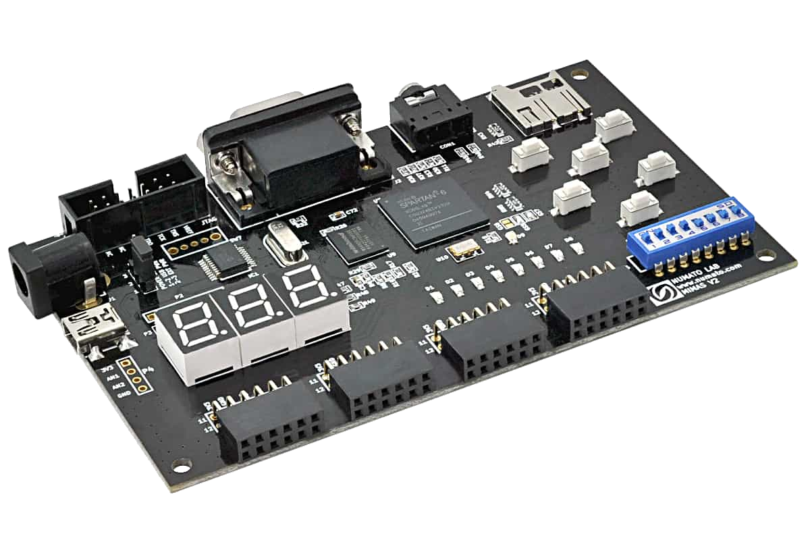

# FPGA Projects — VHDL / Xilinx ISE (Spartan-6)

This repository contains a collection of FPGA projects developed in VHDL and targeted to the **Numato Lab Mimas V2 (Spartan-6 XC6LX9)** board.  
The projects range from basic combinational and sequential circuits to more advanced digital design and signal processing systems.

## Target Hardware
- Board: Numato Lab **Mimas V2**
- FPGA: Xilinx Spartan-6 XC6LX9
- Tools: Xilinx ISE, ISim, ModelSim
- Language: VHDL

---

## Projects

### 🔹 ALU
**Arithmetic Logic Unit**
- Implements a synthesizable ALU in VHDL
- Verified using a dedicated testbench  
📁 `ALU/`

### 🔹 Adders
**Combinational Arithmetic Blocks**
- 4-bit full adder (structural design using 1-bit adders)
- 16-bit signed adder using `numeric_std`  
📁 `Adders/`

### 🔹 Multiplexers
**Combinational Selection Logic**

- 4-to-1 multiplexer (with active-high enable)
- Implemented using `with-select`
- Fully verified with testbench
- Clean separation of `src/` and `tb/`

📁 `Multiplexers/`

---

## Repository Structure

FPGA_Projects/
│
├── ALU/
├── Adders/
├── Multiplexers/
│ ├── src/
│ └── tb/
│
└── README.md

## Design Philosophy

All designs in this repository follow:

- Use of `numeric_std` (no deprecated libraries)
- Strong typing (`unsigned`, `signed`)
- Clear entity/architecture separation
- Independent testbench verification
- Clean folder structure for source and testbench

---

## Future Additions

Planned modules:

- Parameterized generic multiplexer
- Registers & flip-flops
- Counters
- Comparators
- Finite State Machines (FSM)
- UART implementation
- Signal processing blocks

---

## Author
**Vasan Iyer**  
FPGA & Digital Design Engineer  
Focus: VHDL, FPGA Digital Design, Xilinx ISE, Signal Processing  
GitHub: https://github.com/Vaiy108

